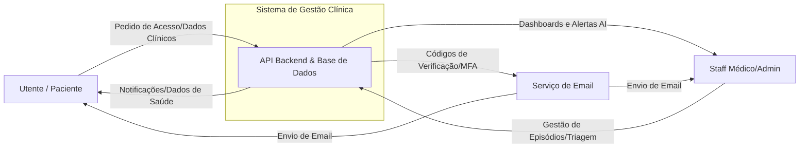
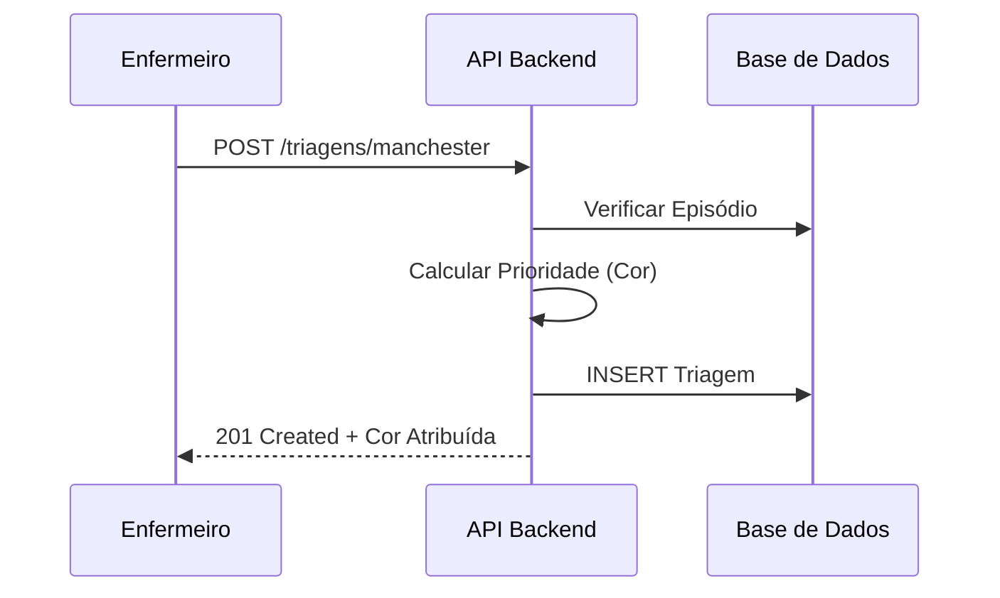
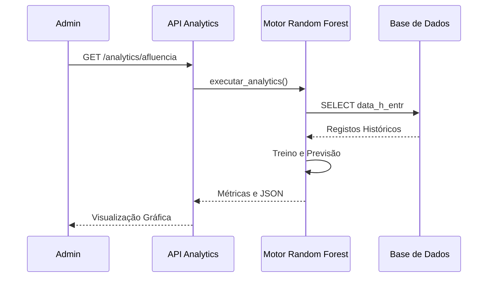

# Documentação de Fluxo de Dados (DFD) - Sistema de Gestão Clínica

Este documento descreve a arquitetura de dados e o fluxo de informação do Sistema de Gestão Clínica, abrangendo desde o nível macro (contexto) até ao detalhe dos processos internos.

---

## 1. Diagrama de Contexto (Nível 0)
O objetivo deste diagrama é mostrar os limites do sistema e as suas interações com as entidades externas.



---

## 2. Diagrama de Fluxo de Dados (Nível 1)
Detalhamento dos grandes módulos do sistema, repositórios de dados e as interconexões principais.

```mermaid
dfd2
    %% Entidades Externas
    entity U as Utente (Mobile)
    entity S as Staff (Web)
    entity E as Serviço de Email

    %% Processos
    process P1 as 1.0<br/>Autenticação e MFA
    process P2 as 2.0<br/>Gestão Clínica<br/>(Registo, Triagem, Atos)
    process P3 as 3.0<br/>Analytics e AI<br/>(Previsão de Afluência)
    process P4 as 4.0<br/>Auditoria e Segurança

    %% Depósitos de Dados (Data Stores)
    storage D1 as [DB] Utilizadores e Utentes
    storage D2 as [DB] Registos Clínicos<br/>(Episódios, Triagens, Prescrições)
    storage D3 as [DB] Logs de Auditoria

    %% Fluxos de Dados
    U -> P1 : Credenciais e Código MFA
    S -> P1 : Credenciais (Admin/Médico)
    P1 -> D1 : Validar Utilizador
    P1 -> E : Enviar Código de Verificação

    S -> P2 : Registar Episódio/Triagem
    P2 -> D2 : Gravar Dados Clínicos
    D2 -> P2 : Consultar Histórico
    P2 -> U : Visualizar Estado/Receitas

    D2 -> P3 : Dados Históricos de Afluência
    P3 -> S : Dashboard de Previsão AI
    P3 -> D2 : Gravar Simulações

    P1 -> P4 : Evento de Login
    P2 -> P4 : Alteração de Registo
    P4 -> D3 : Gravar Log (IP, Utilizador, Ação)
```

---

## 3. Detalhes de Nível 2 (Processos Específicos)

### 3.1. Autenticação e MFA (Processo 1.0)
Focado na segurança de acesso e recuperação de conta.

```mermaid
dfd2
    entity U as Utilizador
    entity E as Provedor de Email

    process P1_1 as 1.1<br/>Validação de Credenciais
    process P1_2 as 1.2<br/>Verificação MFA / TOTP
    process P1_3 as 1.3<br/>Geração de Token JWT

    storage D1 as [DB] Utilizadores
    storage D3 as [DB] Secrets/Tokens

    U -> P1_1 : Username/Pass
    P1_1 -> D1 : Validar
    P1_1 -> P1_2 : Requer MFA
    U -> P1_2 : Código 6 Dígitos
    P1_2 -> D3 : Verificar Secret
    P1_2 -> P1_3 : Autorizado
    P1_3 -> U : JWT Token
```

### 3.2. Triagem de Manchester (Processo 2.0)
Fluxo clínico de atribuição de prioridade.

```mermaid
dfd2
    entity S as Enfermeiro
    
    process P2_1 as 2.1<br/>Recolha de Sinais Vitais
    process P2_2 as 2.2<br/>Lógica Manchester
    process P2_3 as 2.3<br/>Atribuição de Fila

    storage D2 as [DB] Episódios
    storage D3 as [DB] Triagens

    S -> P2_1 : TA, Temp, Sintomas
    P2_1 -> P2_2 : Dados Brutos
    P2_2 -> D3 : Gravar Cor/Prioridade
    P2_2 -> P2_3 : Mover para Fila
    P2_3 -> S : Próximo Utente
```

### 3.3. Analytics e AI (Processo 3.0)
Utilização de Machine Learning (Random Forest) para análise de afluência.

```mermaid
dfd2
    entity AD as Admin
    process P3_1 as 3.1<br/>Extração e Preparação
    process P3_2 as 3.2<br/>Treino do Modelo AI
    process P3_3 as 3.3<br/>Geração de Previsões

    storage D_HIST as [DB] Histórico Episódios

    D_HIST -> P3_1 : Dados Temporais
    P3_1 -> P3_2 : Dataset Processado
    P3_2 -> P3_3 : Modelo Treinado
    P3_3 -> AD : Dashboards (MAE, R2, Gráficos)
```

---

## 4. Diagramas de Sequência (Interações Temporais)

### 4.1. Fluxo de Triagem


### 4.2. Fluxo de Previsão AI


---
*Documento gerado automaticamente para o Grupo 2 - Projeto de Gestão Clínica.*
