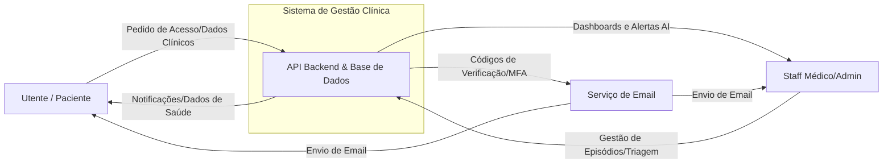
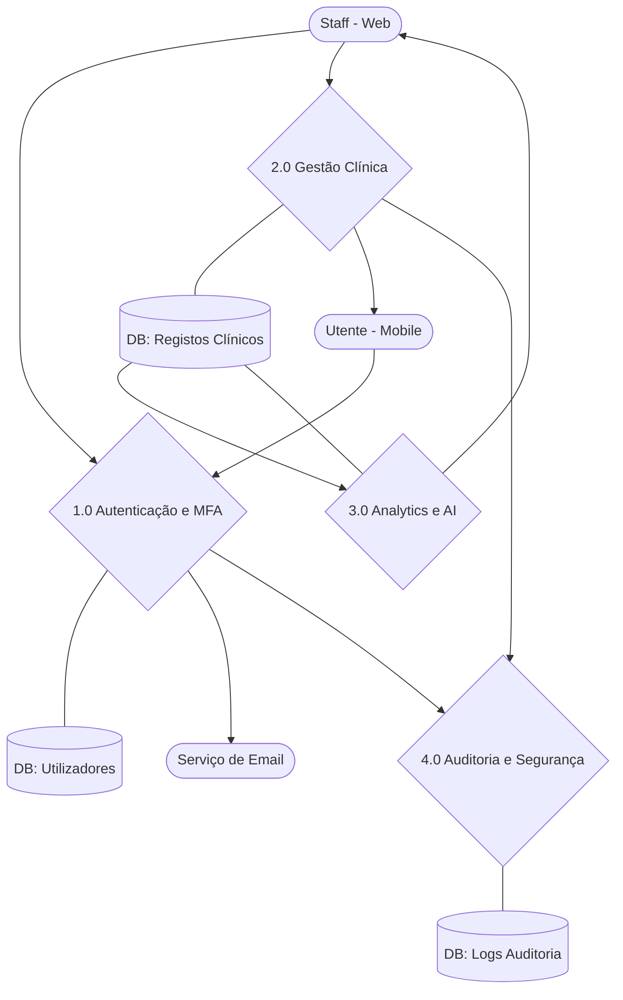
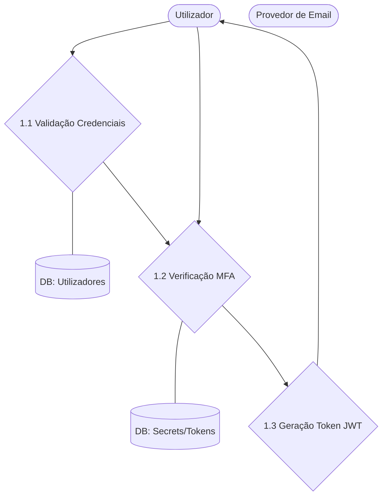
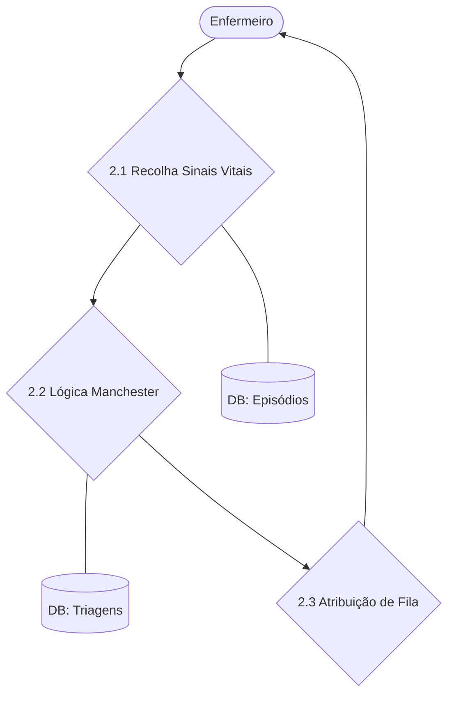
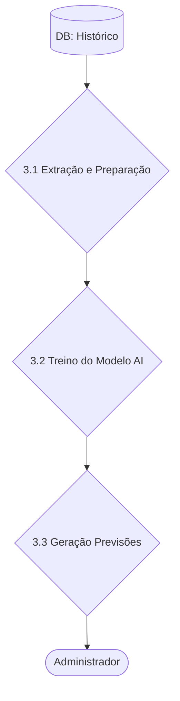
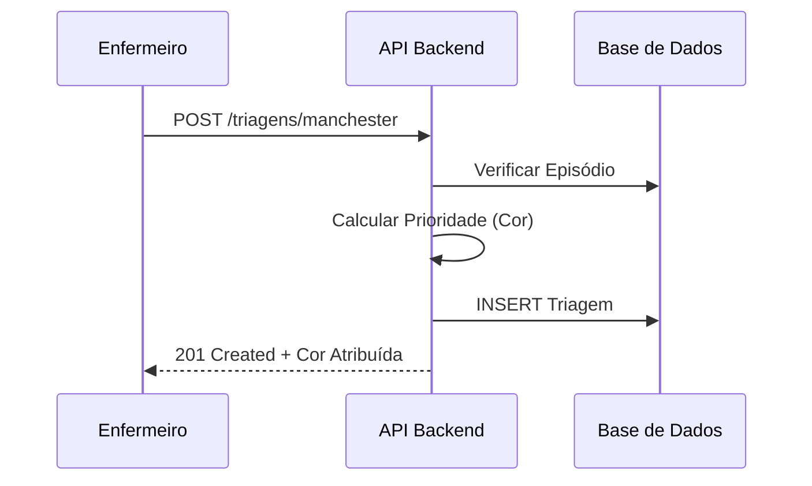
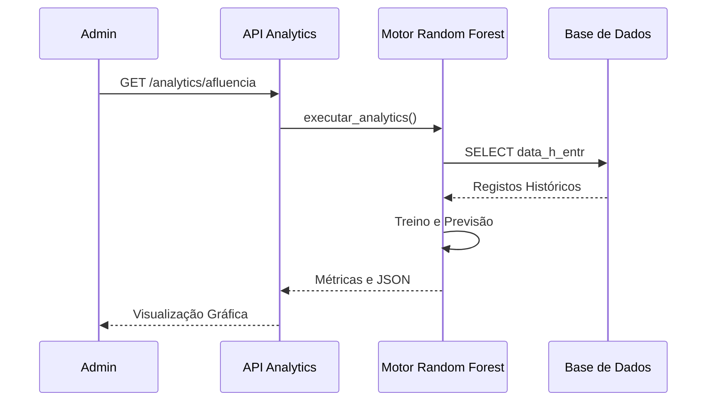

# Documentação de Fluxo de Dados (DFD) - Sistema de Gestão Clínica

Este documento descreve a arquitetura de dados e o fluxo de informação do Sistema de Gestão Clínica, abrangendo desde o nível macro (contexto) até ao detalhe dos processos internos.

---

## 1. Diagrama de Contexto (Nível 0)
O objetivo deste diagrama é mostrar os limites do sistema e as suas interações com as entidades externas.

---

## 2. Diagrama de Fluxo de Dados (Nível 1)
Detalhamento dos grandes módulos do sistema, repositórios de dados e as interconexões principais.

---

## 3. Detalhes de Nível 2 (Processos Específicos)

### 3.1. Autenticação e MFA (Processo 1.0)
Focado na segurança de acesso e recuperação de conta.

### 3.2. Triagem de Manchester (Processo 2.0)
Fluxo clínico de atribuição de prioridade.

### 3.3. Analytics e AI (Processo 3.0)
Utilização de Machine Learning (Random Forest) para análise de afluência.

---

## 4. Diagramas de Sequência (Interações Temporais)

### 4.1. Fluxo de Triagem

### 4.2. Fluxo de Previsão AI

---
*Documento gerado automaticamente para o Grupo 2 - Projeto de Gestão Clínica.*
